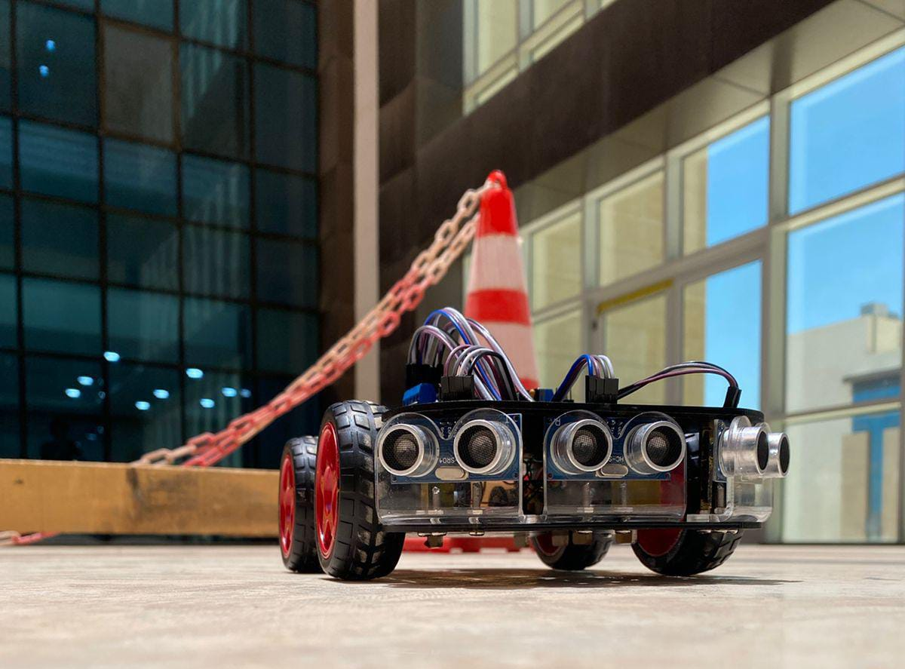

# Obstacles-Avoider-Arduino-Car

## Car Components
1. Arduino Uno
2. L293R Shield
3. Motors and wheels
4. Ultrasonic sensors
5. Battery holder
6. Switch button
7. Jumpers
8. Smart car chassis
9. Ultrasonic sensor holder

## Process
We utilized 3 ultrasonic sensors to enhance obstacle avoidance capabilities from multiple angles, ensuring smoother and faster movement. Additionally, 4 batteries were employed to provide optimal voltage for improved performance.

## Arduino Uno Connections

1. Ultrasonic Sensor 1 (Front):
   - Trig Pin: Connected to Arduino digital pin A4
   - Echo Pin: Connected to Arduino digital pin A5

2. Ultrasonic Sensor 2 (Right):
   - Trig Pin: Connected to Arduino digital pin A0
   - Echo Pin: Connected to Arduino digital pin A1

3. Ultrasonic Sensor 3 (Left):
   - Trig Pin: Connected to Arduino digital pin A2
   - Echo Pin: Connected to Arduino digital pin A3

### L293R Shield Connections
- Motor 1 (Front Left): Connected to L293R Shield motor port 1
- Motor 2 (Front Right): Connected to L293R Shield motor port 2
- Motor 3 (Back Left): Connected to L293R Shield motor port 3
- Motor 4 (Back Right): Connected to L293R Shield motor port 4

### Battery Holder
- Connected to power the Arduino Uno and L293R Shield

### Switch Button
- Connected to control the power supply to the Arduino Uno and L293R Shield

### Ultrasonic Sensor Holder
- Used to mount the ultrasonic sensors securely on the car chassis

## Result 

